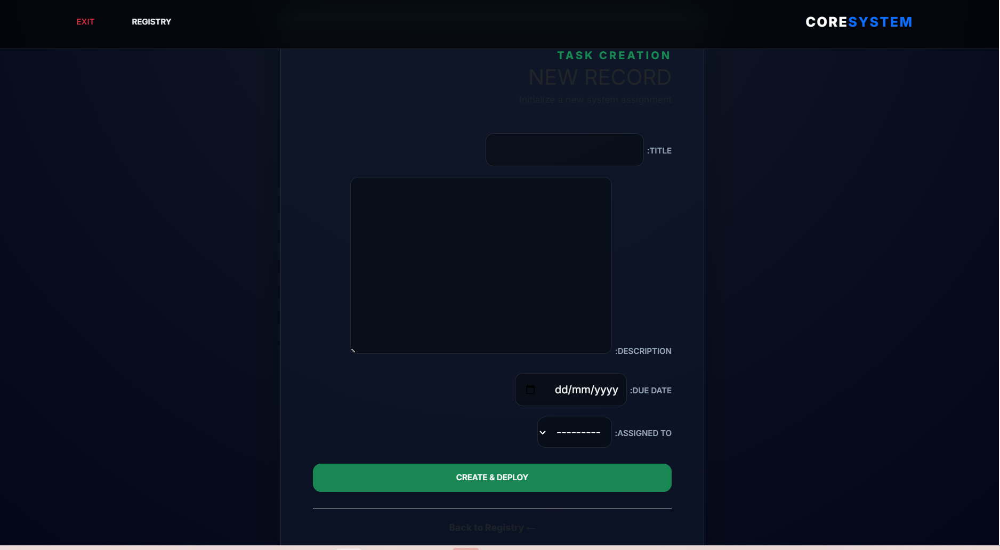
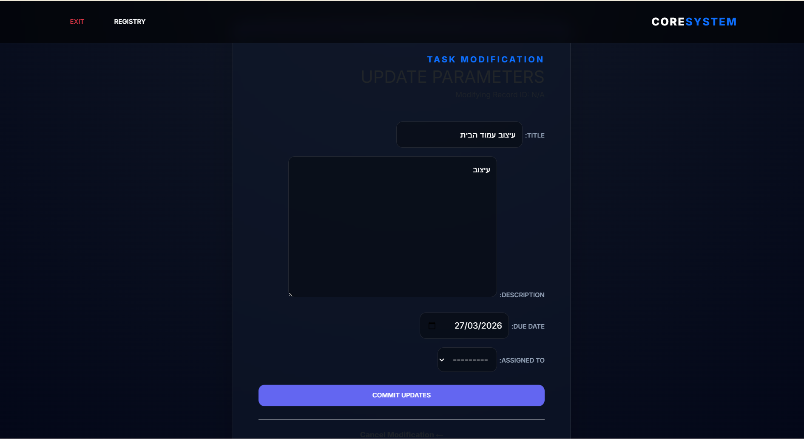
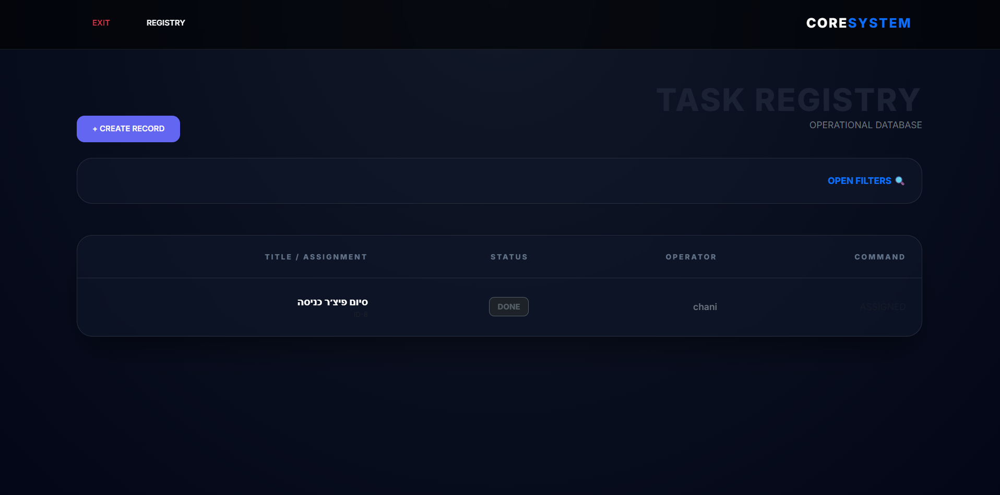
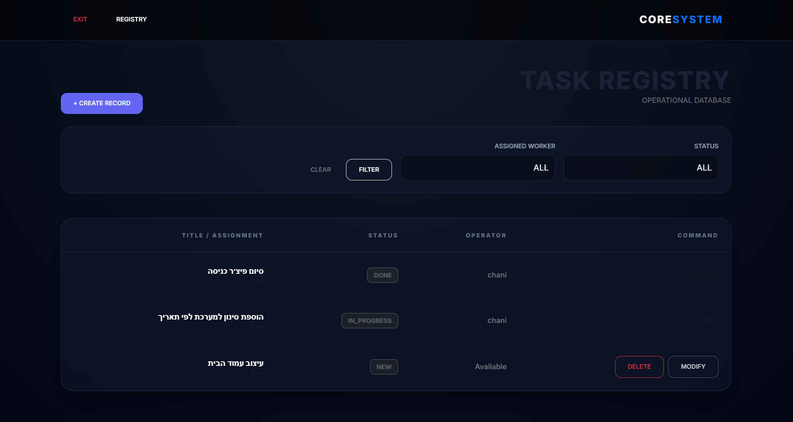
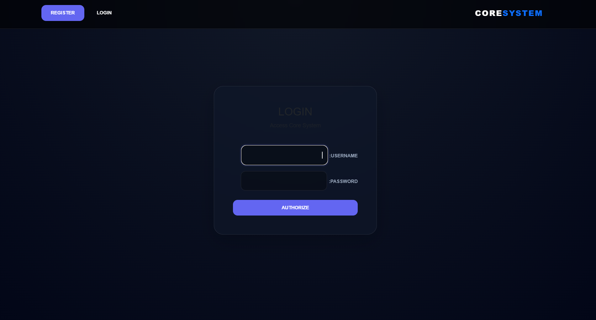
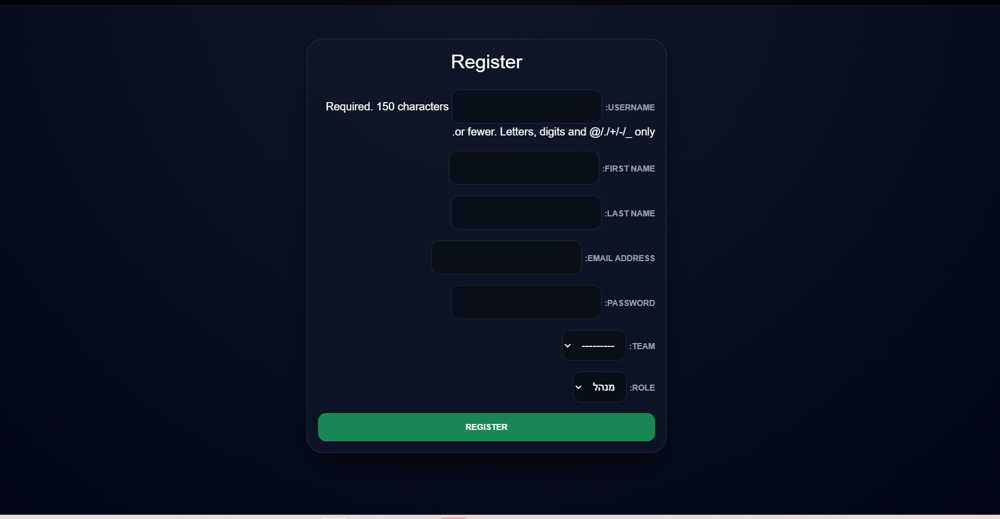

# מערכת ניהול משימות לצוות (Task Management System)

פרויקט זה הוא מערכת לניהול משימות לצוותים שנבנתה באמצעות **Django**.
המערכת מאפשרת למנהלים ליצור ולנהל משימות, ולעובדים לקחת משימות ולעדכן את הסטטוס שלהן.

---

# תכונות עיקריות

## משתמשים והרשאות

במערכת קיימים שני סוגי משתמשים:

* **Manager (מנהל)**
* **Worker (עובד)**

לכל משתמש משויך:

* צוות
* תפקיד במערכת

---

# פעולות מנהל

מנהל יכול:

* ליצור משימה חדשה
* לערוך משימה
* למחוק משימה (רק אם לא משויכת לעובד)
* לשייך משימה לעובד מהצוות שלו
* לראות את כל המשימות של הצוות

### מסך יצירת משימה



### מסך עריכת משימה



---

# פעולות עובד

עובד יכול:

* לראות את המשימות של הצוות שלו
* לקחת משימה שלא משויכת לעובד
* לעדכן סטטוס של משימה שהוא מבצע

### מסך רשימת משימות לעובד



---

# סטטוסים של משימה

לכל משימה יש סטטוס:

* **new** – משימה חדשה
* **in_progress** – משימה בתהליך
* **done** – משימה הושלמה

---

# סינון משימות

במסך רשימת המשימות ניתן לסנן לפי:

* סטטוס משימה
* האם משימה משויכת לעובד או לא

הסינון מופיע רק כאשר המשתמש לוחץ על כפתור **"סינון משימות"**.

### מסך סינון משימות



---

# מבנה בסיס הנתונים

## מודלים עיקריים

### User

משתמש של Django.

### Profile

כולל:

* משתמש
* צוות
* תפקיד (manager / worker)

### Team

כולל:

* שם הצוות

### Task

כולל:

* כותרת
* תיאור
* תאריך יעד
* סטטוס
* צוות
* עובד משויך

---

# טכנולוגיות

המערכת נבנתה באמצעות:

* Python
* Django
* HTML
* Django Templates
* SQLite (ברירת מחדל של Django)

---

# התקנה והרצה

שכפול הפרויקט:

```
git clone <repository-url>
```

כניסה לתיקיית הפרויקט:

```
cd project
```

הפעלת הסביבה הווירטואלית:

```
venv\Scripts\activate
```

התקנת התלויות:

```
pip install -r requirements.txt
```

הרצת מיגרציות:

```
python manage.py migrate
```

הרצת השרת:

```
python manage.py runserver
```

פתיחת האתר בדפדפן:

```
http://127.0.0.1:8000
```

---

# מסכים במערכת

המערכת כוללת מספר מסכים עיקריים:

* התחברות משתמש
* הרשמה למערכת
* רשימת משימות
* יצירת משימה
* עריכת משימה
* סינון משימות

### מסך התחברות



### מסך הרשמה



---

# הערות

* משתמש רואה רק משימות של הצוות שלו.
* מנהל לא יכול למחוק משימה שכבר משויכת לעובד.
* עובד יכול לשנות סטטוס רק למשימות שהוא מבצע.

פרויקט זה נבנה לצורך **למידה ותרגול Django ופיתוח מערכות Web**.
